# 💥声明

💥此项目仅用于学习与研究目的，使用者需自行承担相应风险与责任，切勿用于违法犯罪，如违反此声明产生任何问题与作者无关。

# 24adbspy

一个轻量级的安卓设备 Web 管理与调试工具。提供设备列表、无线连接、一次性命令执行、交互式终端、文件管理、截屏、以及联系人/短信/定位/WiFi 等信息查看。


## 特性
- 设备管理：列出已连接设备，支持无线 `ip:port` 连接
- 一次性命令：在 Shell 标签中输入并执行单条命令
- 交互式终端：通过浏览器获得类终端的交互体验
- 文件管理：浏览目录、上传/下载、查看、重命名、删除
- 截屏：一键获取设备当前屏幕图像
- 信息采集：联系人、短信、定位、WiFi 信息
- 本地依赖：xterm.js 等资源已本地化，避免外网依赖导致的加载慢问题

## 环境要求
- Go 1.20+（建议）
- Windows 或 Linux/macOS
- 本地已安装并可执行的 `adb`（Windows 下支持在项目根目录放置 `adb.exe`）

### 本地安装adb

参考：https://blog.csdn.net/Javachichi/article/details/145017825

**Windows**

二进制包内有自带的adb.exe

或者

https://dl.google.com/android/repository/platform-tools-latest-windows.zip

**Linux**

apt安装

```
sudo apt update
sudo apt install adb
```

**Macos**

https://dl.google.com/android/repository/platform-tools-latest-darwin.zip


## 快速开始

- Windows
  - 运行 `.\build.bat`
  - 执行 `.\bin\24adbspy.exe`
  - 浏览器访问 `http://localhost:15555`
- Linux/macOS
  - 运行 `bash build.sh`
  - 执行 `./bin/24adbspy`
  - 浏览器访问 `http://localhost:15555`

## 使用说明
- 顶部下拉框选择设备，或在右侧输入 `ip:port` 后点击 `Connect` 进行无线连接
- 标签页说明：
  - `Shell`：一次性命令执行，适合快速查询
  - `Terminal (Interactive)`：交互式终端，适合持续操作
  - `Files`：文件/目录查看与操作（查看、下载、重命名、删除、上传）
  - `Screenshot`：截屏并在页面展示
  - `Spy Info`：联系人、短信、定位、WiFi 信息查看

## 交互式终端说明
- 为确保在 Windows 环境也能稳定交互，后端使用 `adb shell -t -t` 强制远端分配 PTY
  - 代码位置：`handlers/terminal.go:45`
- 为避免回车需要按两次：
  - 后端将前端发送的 `\r` 转换为 `\n`，保证 `adb` 立即执行命令
  - 代码位置：`handlers/terminal.go:117`
- 为降低输出延迟：
  - 前端将 WebSocket 设置为 `arraybuffer`，直接写入 xterm
  - 代码位置：`static/app.js:159`

## 文件管理
- 列表中支持查看、下载、重命名、删除
- 文本与图片文件可直接在浏览器新标签预览（后端使用 `exec-out cat` 输出）
- 删除操作带有基本的安全检查，避免误删系统关键路径

## 构建与目录
- Windows 构建脚本：`build.bat`，输出到 `bin` 目录并复制 `static` 资源
- Linux/macOS 构建脚本：`build.sh`，输出到 `bin` 目录并复制 `static` 资源
- 可执行文件与静态资源位于 `bin/` 下，方便打包与分发

## 常见问题
- 交互终端显示 “Remote PTY will not be allocated…”：
  - 已启用双 `-t`（`adb shell -t -t`），若仍异常，请确认设备允许 shell 分配 PTY
- 回车无响应或需要按两次：
  - 已在后端做 `\r` 转 `\n` 适配；若仍异常，清理浏览器缓存后重试
- 加载慢：
  - 项目已使用本地化的前端依赖，请确认浏览器未被代理或拦截
- 短信/联系人为空：
  - 可能是权限或系统版本差异导致；项目已加入降级查询和解析逻辑，具体见 `handlers/info.go`

## 安全提示
- 文件删除功能包含基础防护，但请谨慎操作生产设备
- 请在合法合规的前提下使用信息采集功能（联系人/短信/定位/WiFi）

## 演示

### 连接adb

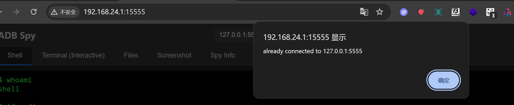

### 选择adb连接

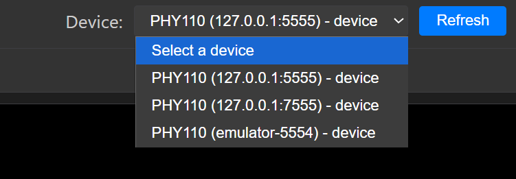

### 普通终端

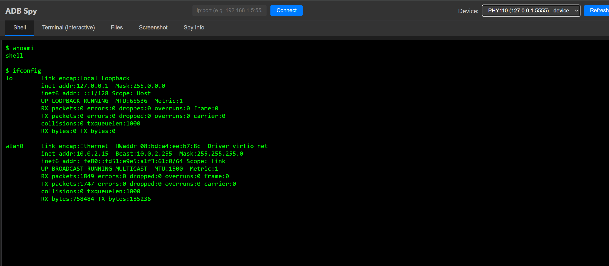

### 交互终端

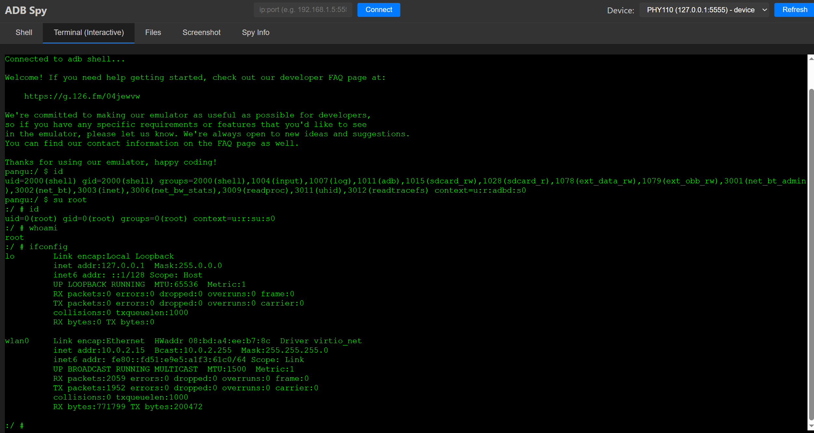

### 文件管理

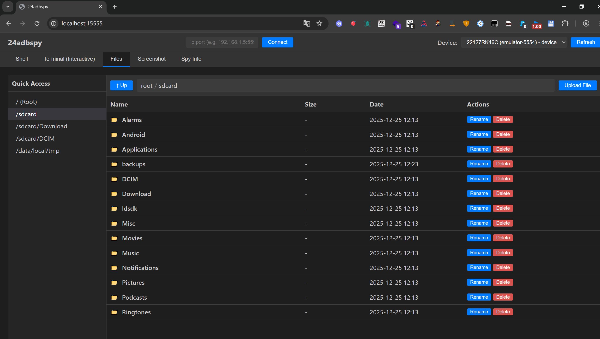

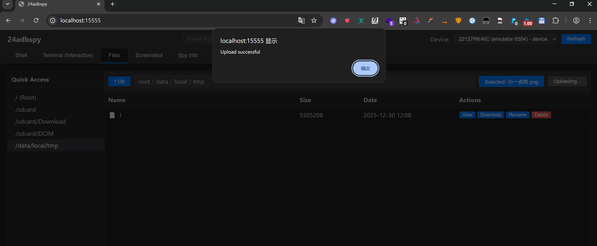

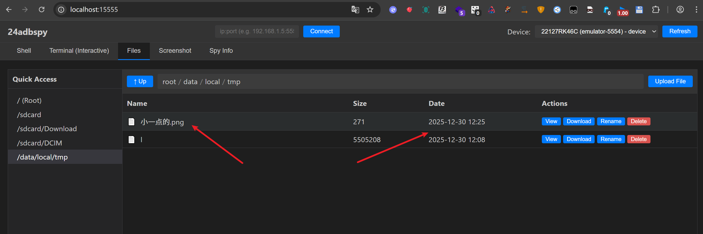

### 截图

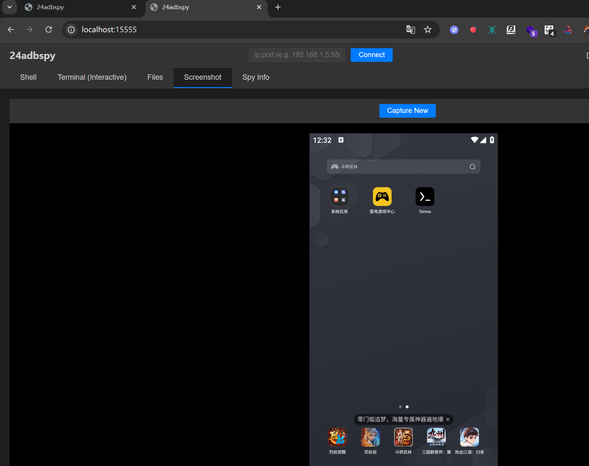

### 获取敏感信息

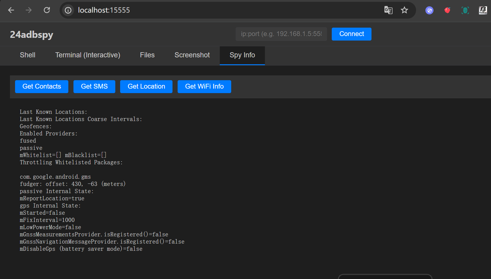

### 获取电池

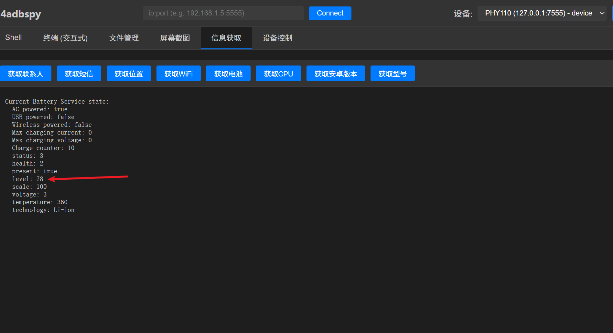

### 获取安卓版本

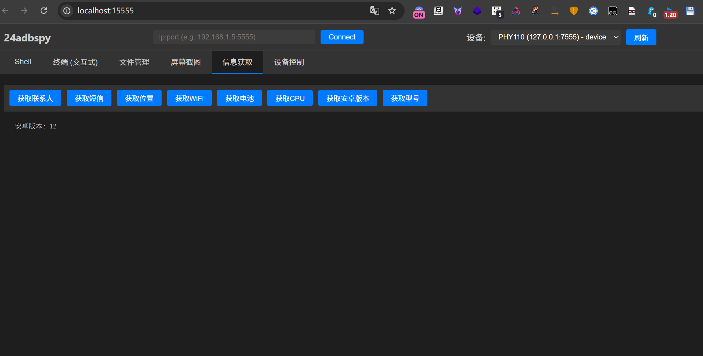

### 获取型号

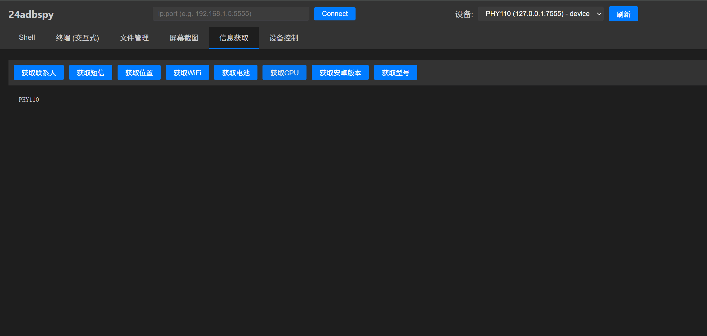

## 设备控制

### 打开计算器

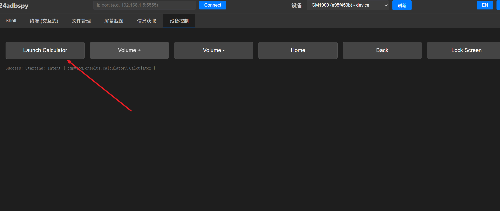


### 音量加减

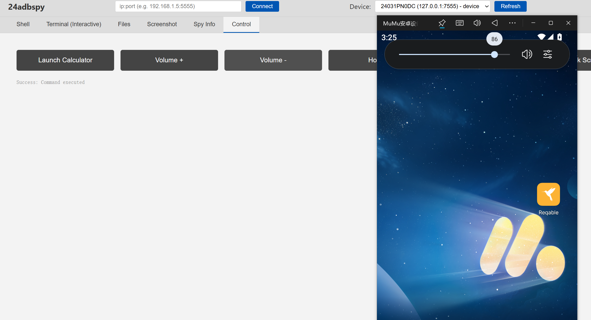

## UI升级

### 切换中英文

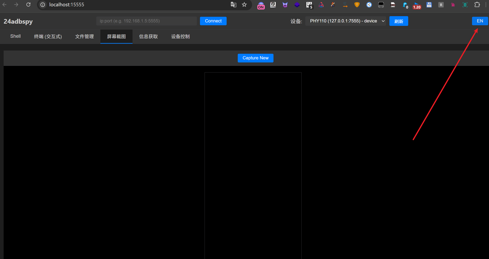

### 切换暗黑白主题

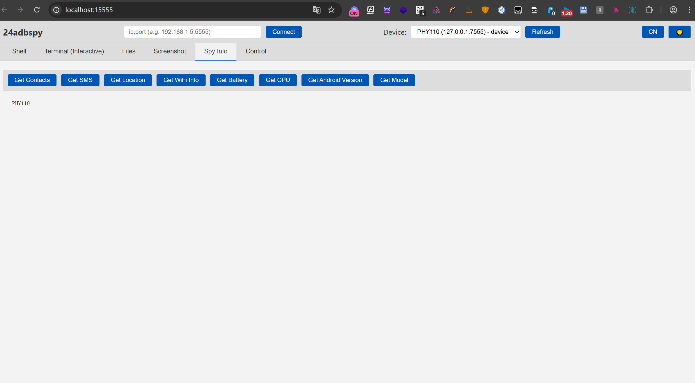


## 更新日志

2026.02.24 更新24adbspy3.0 新增一些功能，优化UI界面，新增中英文切换等

2025.12.25 发布24adbspy2.0。